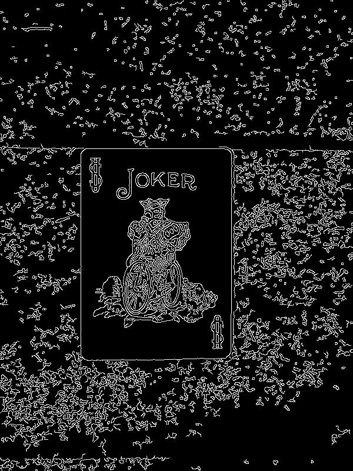
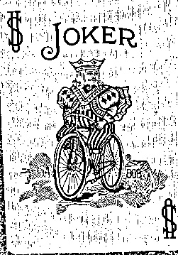

# 📄 Document Scanner (Computer Vision)

A bsaic Python-based document scanner which detects paper in images, corrects the perspective, and applies adaptive thresholding to create a clean and scanned output. This tries to mimic the functionality of apps like CamScanner or Adobe Scan.

## 🎯 Project Overview
In the field of OCR and Document Digitization, raw images are often tilted or have uneven lighting. This tool tries to solve those problems using classical Computer Vision techniques:
* **Edge Detection:** Uses Canny Edge Detection to find document boundaries.
* **Geometry:** Calculates a 4-point perspective transform to "flatten" the document from a tilted angle.
* **Image Processing:** Applies adaptive Gaussian thresholding to remove shadows and binarize the image.

## 🛠️ Tech Stack
* **Language:** Python 3.x
* **Libraries:** OpenCV (`cv2`), NumPy

## 📸 Demo
| Original Input | Edge Detection | Scanned Output |
| :---: | :---: | :---: |
|  |  |  |

## 🚀 How to Run
1.  **Clone the repository:**
    ```bash
    git clone https://github.com/EvansDesikan/Document_Scanner.git
    cd Document_Scanner
    ```
2.  **Install dependencies:**
    ```bash
    pip install -r requirements.txt
    ```
3.  **Run the scanner:**
    ```bash
    python scanner.py
    ```
    *(Ensure you have an image named `paper2.jpg` in the folder).*

## 🧠 Key Algorithms Used
1.  **Canny Edge Detection:** To identify sharp changes in intensity.
2.  **Contour Approximation (`cv2.approxPolyDP`):** To simplify the border into a 4-point polygon.
3.  **Perspective Warp:** Uses a transformation matrix to map the 4 ordered corners to a flat rectangle.
