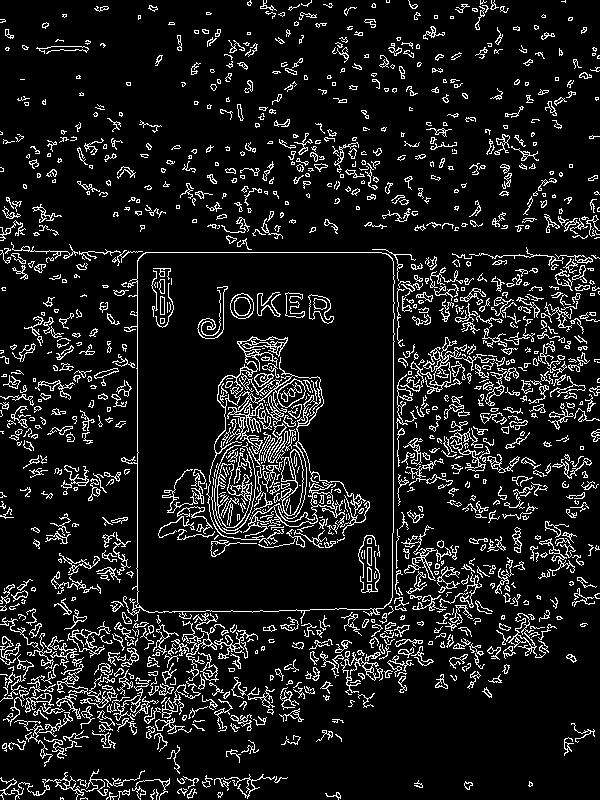
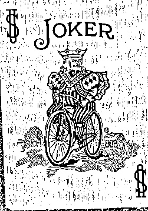

# Document scanner: classical OpenCV pipeline

Turns a photo of a tilted page into a flat, clean, scanner-style image, like CamScanner, using only classical computer vision (no deep learning).

| Photo | Detected edges | Scanned output |
| :---: | :---: | :---: |
|  |  |  |

## Pipeline

1. **Pre-processing:** greyscale and Gaussian blur to suppress texture.
2. **Edge detection:** Canny.
3. **Page finding:** largest contour, simplified to four corners with `cv2.approxPolyDP`.
4. **Perspective correction:** the four corners are ordered and mapped to a rectangle with a homography (`cv2.getPerspectiveTransform`, `cv2.warpPerspective`).
5. **Clean-up:** adaptive Gaussian thresholding removes shadows and uneven lighting.

## Run it

```bash
python3 -m venv .venv && source .venv/bin/activate
pip install -r requirements.txt
python scanner.py          # reads paper2.jpg, writes scanned_document.jpg
```

## Limitations and next steps

- Fails when the page edge has low contrast against the background, or when part of the page is outside the photo.
- Next: fall back to Hough lines when no four-corner contour is found; add OCR (Tesseract) on the flattened page.

## Tech

Python · OpenCV · NumPy
